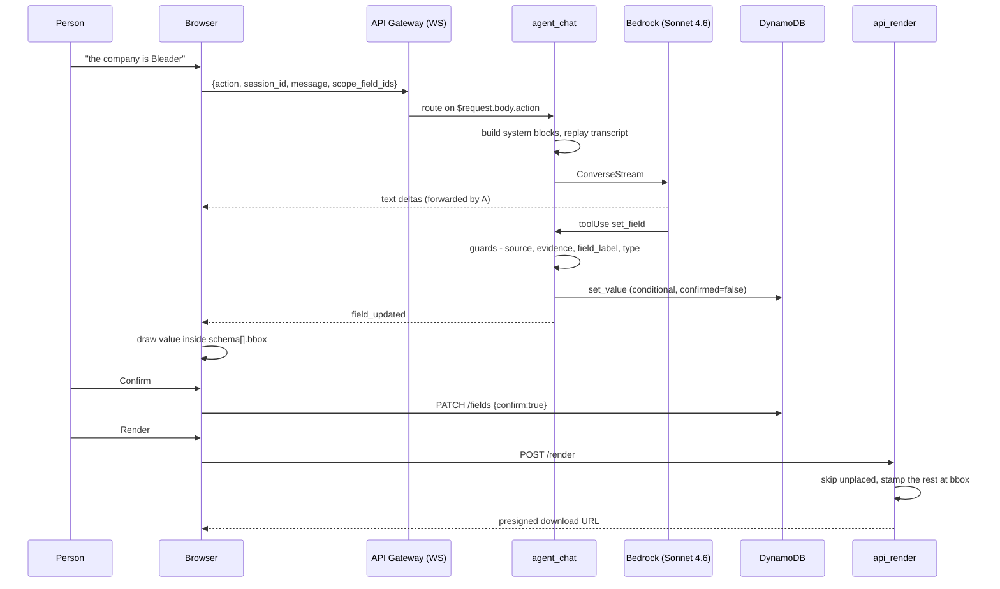

# From a sentence in the chat box to ink on the PDF

This traces one path end to end: a person types *"the company is Bleader"*, and
that word ends up drawn inside the right rectangle of a filled PDF. Everything
else in the system exists either to serve this path, or to define the form it
runs against.

The most important thing to understand first is that **this path never decides
where a box is.** Geometry is settled once, when a form is *defined*, and is read
out of the PDF rather than guessed. Filling is a separate, cheap, frequent act
that looks the answer up. Mixing those two together is what produced the original
bug, where a correct value was stamped across the form's instructions paragraph.

```
 ┌─ DEFINE (once per form) ──────────────────────────────────────────────┐
 │  ingest_extract   ruled cells + text, read out of the PDF             │
 │  ingest_enrich    Opus 4.8 picks a region id per field                │
 │  ingest_finalize  schema.json + form-map.md                           │
 └───────────────────────────────┬───────────────────────────────────────┘
                                 │  schema[].bbox
                                 ▼
 ┌─ FILL (every session) ────────────────────────────────────────────────┐
 │  chat → WebSocket → Sonnet 4.6 → set_field → DynamoDB → viewer        │
 │  confirm → render → reportlab stamps the value at bbox                │
 └───────────────────────────────────────────────────────────────────────┘
```

---

## The nine steps



### 1. The message leaves the browser

[`chat.js`](site/js/chat.js) reads the textarea, appends the user's bubble
optimistically, and collects `state.selectedFieldIds` — whatever boxes the person
clicked in the document view. [`ws-client.js`](site/js/ws-client.js) wraps it:

```json
{ "action": "message", "session_id": "...", "message": "the company is Bleader",
  "scope_field_ids": ["employer_name"] }
```

`scope_field_ids` is not cosmetic. It shrinks the prompt to one section and
constrains where the agent is allowed to write.

The textarea can also be filled by voice. [`voice.js`](site/js/voice.js) records,
[`audio-wav.js`](site/js/audio-wav.js) re-encodes to 16 kHz mono WAV — Gemini does
not document the webm and mp4 containers browsers actually record — and
[`stt.js`](site/js/stt.js) posts it. The transcript lands in the box for the person
to read before sending, rather than going straight to the agent: a misheard value
here would be written to the form as `user_said` evidence.

**That transcription endpoint is not part of this stack.** It is a public `/stt`
route on the separate `text-to-sql` API, so DeployBackend — which rewrites
`config.json` from *our* CloudFormation outputs — cannot discover it, and the URL
lives as a constant in [`config.js`](site/js/config.js) instead. Its `OPTIONS`
method is also broken (returns 500), which is why `stt.js` sends no request headers
at all: that keeps the POST a CORS simple request, so no preflight ever fires.
Adding a header there breaks transcription with an opaque browser CORS error.

### 2. API Gateway routes on the body, not the path

One WebSocket API serves two agents.
[`template.yaml`](lambdas/template.yaml) sets
`RouteSelectionExpression: "$request.body.action"`, so `message` reaches the
filling agent and `author` reaches the authoring one. They share
[`agent_loop.py`](lambdas/common/agent_loop.py) and nothing else — the toolConfig
is chosen per turn, so no filling turn can edit a guide and no authoring turn can
write a form value.

Why a socket at all: Lambda response streaming is Node-only in the managed
runtime, plain REST would hit API Gateway's 29-second integration timeout on any
multi-tool turn, and only a socket lets the agent push `highlight` mid-sentence
to scroll the viewer while it is still talking.

### 3. The turn is assembled

[`agent_chat._turn`](lambdas/functions/agent_chat.py) refuses early if the session
is not `ready` or the message is blank — an empty text block written into a
durable transcript is rejected by Bedrock on *every subsequent turn*, not just the
one that created it.

The system prompt is built in blocks, and the order is deliberate:

| block | contents | cached |
|---|---|---|
| `SYSTEM` | standing rules: never guess, everything is a draft, repeated labels are different boxes | yes |
| `_form_context` | `agent_view` of the fields — id, label, type, section, current value. **No coordinates.** | yes |
| `_map_block` | `form-map.md`: which row and side each box is, every repeated label named | yes |
| `guide.prompt_block` | human-written guidance, if this form has any | yes |
| | *← the `cachePoint` sits here →* | |
| `_recent_changes` | fields the person edited by hand since the last turn | no |

Everything above the cache point is byte-identical for the life of the session,
so after turn one it costs almost nothing. Everything volatile sits below it.
`_recent_changes` exists because without it the agent re-asks for values the
person just typed themselves, which is the fastest way to make it feel broken.

`agent_view` **deliberately drops `bbox`**. Pixel geometry is not what a language
model reasons with; *"row 1, 2nd box from the right"* is, and that is what the
form map supplies.

### 4. Streaming, and the tool loop

[`agent_loop.run_turn`](lambdas/common/agent_loop.py) calls `ConverseStream` and
reassembles content blocks as they arrive, forwarding text deltas to the browser
as `text` events so the reply types out live.

Before every call, `sanitize` prunes anything Converse would reject: empty text
blocks, tool results whose call has fallen out of the 24-message window, a
trailing tool call nothing answered. It runs on the way *in*, not only at write
time, because the transcript is durable — a session damaged by an older bug has
to keep working, and there is no migration path to a DynamoDB item nobody can see.

When the model emits `toolUse`, the loop dispatches, pushes `tool_start` and
`tool_end` for the activity display, and feeds results back as a `user` message.
It repeats up to `MAX_AGENT_TURNS`, then pauses with a message making clear that
everything written so far is saved.

### 5. `set_field` — four guards before anything is written

[`tools._write_one`](lambdas/common/tools.py) is where the trust model lives. A
write is refused unless all of these hold:

1. **The field exists.** An invented `field_id` is rejected, not created.
2. **`source` is real** — `user_said`, `profile`, or `source_doc`. There is no
   `inferred`. If none apply, the agent does not have the value and must ask.
3. **`evidence` is present** — the quote or document text this came from.
4. **`field_label` matches the schema.** The model states which box it believes it
   is writing into, and a mismatch is refused *with the fields that really do
   carry that label listed*, so it can correct itself inside the same turn.

Guards 2 and 3 establish that a value is **real**. Guard 4 establishes that it is
going to the **right place** — a distinction this system learned the hard way,
because a correct, correctly-sourced value in the wrong cell passes 1 to 3
cleanly.

Then `schema.validate_value` checks type, regex and length, and only then
[`store.set_value`](lambdas/common/store.py) does a conditional DynamoDB write on
`version`. Values are one item per field, not one blob: two writers — the person
typing and the agent — share this state, and a single item would let them clobber
each other.

The value lands as `source: "agent"`, `confirmed: false`. **On an official form
the model drafts and a human attests.**

### 6. The browser draws it, immediately

`ctx.emit("field_updated")` pushes straight down the socket mid-turn.
[`chat.js`](site/js/chat.js) calls `applyFieldUpdate`, which mutates the store and
notifies; [`viewer.js`](site/js/viewer.js) rebuilds the page overlay.

`fieldBox` positions each box as a **percentage** of the page image:

```js
box.style.left = `${x0 * 100}%`;
box.style.top = `${y0 * 100}%`;
box.style.width = `${Math.max(0, x1 - x0) * 100}%`;
```

Percentages rather than pixels, so the overlay stays correct at any zoom with no
rescaling. The value is drawn inside the box with `dir="auto"`, which resolves to
the same side the renderer will later pick: Hebrew hugs the right edge, a leading
digit hugs the left.

This overlay is the only way to check placement *before* the final render, which
is strict and downloads rather than displays.

**A field whose box failed ingest's checks (`bbox_confidence: "low"`) is drawn
nowhere.** It appears in the fields panel with a "place it" affordance instead.
An unplaced field is visibly unplaced; a misplaced one looks finished.

### 7. The human attests

The value stays a draft until a person confirms it.
[`render.js`](site/js/render.js) surfaces the outstanding list, and each Confirm
sends `PATCH /sessions/{id}/fields` with `{confirm: true, expected_version}`.
`store.confirm_value` flips `confirmed` **without touching `value` or `source`**,
so the record of who actually wrote it — and the evidence behind it — survives.

### 8. Render — where the coordinates are finally used

`POST /sessions/{id}/render` → [`api_render`](lambdas/functions/api_render.py).
A strict render (the default) refuses on validation errors, missing required
fields, unconfirmed drafts, **or any filled field with no known box**. That last
one because a document quietly missing an answer is worse than one that refuses
to export.

For a flat PDF, `_stamp_overlay` builds one transparent reportlab canvas per page
and merges it onto the original. `_draw_field` does the coordinate flip:

```python
# bbox is normalized top-left origin; PDF user space is bottom-left.
left = x0 * page_w
right = x1 * page_w
bottom = (1.0 - y1) * page_h
top = (1.0 - y0) * page_h
```

Font size is derived from the box height, the baseline is centred within it, and
Hebrew goes through the bidi algorithm before drawing — reportlab lays glyphs
strictly left to right, so an unprocessed RTL string comes out reversed. It is
then right-aligned with `drawRightString`.

An AcroForm PDF skips all of this and sets real form-field values with pypdf,
which is higher fidelity and keeps the document machine-readable. Same agent,
same state, different backend — which is exactly why `set_field` never knew or
cared what kind of document it was working on.

### 9. Download

The output goes to `outputs/{sid}/filled.pdf` in ArtifactsBucket and comes back as
a presigned URL. `flatten` is offered because some agencies require a flattened
PDF and others require the fillable form intact.

---

## The load-bearing invariants

**The agent never touches the document.** It edits form state; rendering is a
separate step. This is the reason one agent works across PDF, DOCX, fillable and
flat.

**Where a box is, is decided at definition time — never during a fill.** The fill
path reads `schema[].bbox` and cannot alter it. The only things that move a box
are a person dragging it (`PATCH /sessions/{id}/schema`) or a deliberate
re-ingest.

**A value with no trustworthy box is never stamped.** Refused by `sanity_check` at
ingest, drawn nowhere by the viewer, skipped by the renderer, and blocked by a
strict export. A blank box beats a wrong one on an official form.

**Every write carries a source, evidence, and the label of its target.** The first
two say the value is real. The third says it is in the right place.

**The transcript is durable, so it is normalised on read as well as on write.**
One block Bedrock rejects kills not the turn that wrote it but every turn after
it, permanently.

**The event log feeds the next prompt.** Manual edits between turns are visible to
the agent, or it re-asks for what the person just typed.

---

## Where to look

| you want | file |
|---|---|
| the message leaving the browser | [`site/js/chat.js`](site/js/chat.js), [`ws-client.js`](site/js/ws-client.js) |
| speech going in, and the reply coming back out | [`voice.js`](site/js/voice.js), [`audio-wav.js`](site/js/audio-wav.js), [`stt.js`](site/js/stt.js), [`speak.js`](site/js/speak.js) |
| the turn being assembled | [`lambdas/functions/agent_chat.py`](lambdas/functions/agent_chat.py) |
| streaming and the tool loop | [`lambdas/common/agent_loop.py`](lambdas/common/agent_loop.py) |
| the write guards | [`lambdas/common/tools.py`](lambdas/common/tools.py) |
| per-field storage and versions | [`lambdas/common/store.py`](lambdas/common/store.py) |
| the on-page overlay | [`site/js/viewer.js`](site/js/viewer.js) |
| coordinates turning into ink | [`lambdas/functions/api_render.py`](lambdas/functions/api_render.py) |
| where boxes come from | [`lambdas/common/geometry.py`](lambdas/common/geometry.py), [`ingest_enrich.py`](lambdas/functions/ingest_enrich.py) |
| everything else in the backend | [`lambdas/README.md`](lambdas/README.md) |
